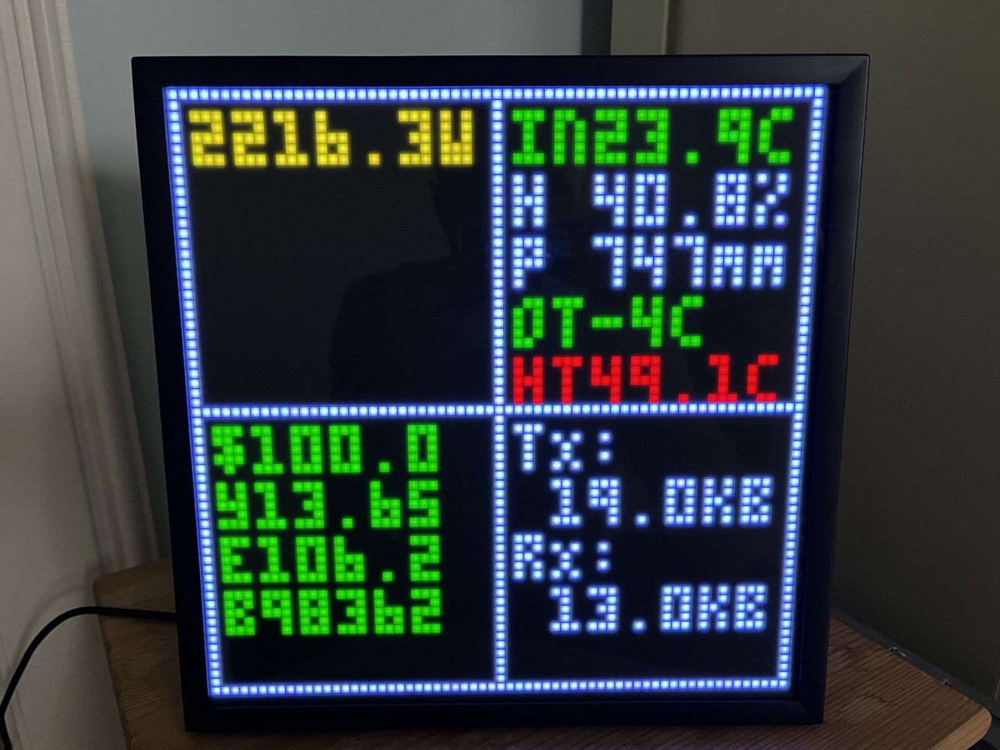
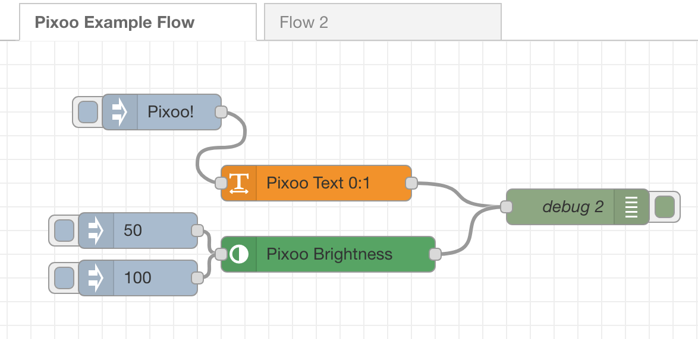

# Node-RED Pixoo Dashboard Module





## Overview

This Node-RED module lets you display text information on a basic dashboard using the Divoom Pixoo 64.

You can use up to 20 fields, each with 7 characters, grouped into 4 identical blocks. Each field supports custom text color.

The module communicates with the Pixoo 64 over the network, so your Node-RED setup must have IP access to the device.

### Compatible devices

[Divoom Pixoo 64](https://divoom.com/products/pixoo-64)

## Install

```
$ npm install @nickiv/node-red-pixoo-dash
```

## Usage

To display a text field, drag the Pixoo Text node into your flow. In the text settings, specify the column number (0 or 1), row number (0-9), and text color.

All node settings can be overridden via the input message.

To adjust the brightness, including turning the display off, use the Pixoo Brightness node. You can set the brightness as a percentage in the node settings or pass it in the payload.

## Disclaimer

This module’s code is based on [pixoo64-js](https://github.com/Byteschmiede/pixoo64-js). I recommend using that library if you need to display more complex content on the Pixoo 64.

If something isn't working or you have suggestions for improvements, feel free to create an issue. I’ll consider all improvement suggestions as long as they don’t make the module overly complex.